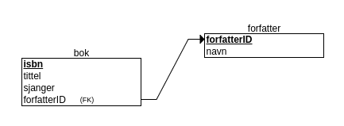

# Uke 39

## Skjema og databaser

### Databaser

Vi skal nå begynne å lage enkle databaser. En database er en strukturert lagringsmåte slik at det skal være enkelt/effektivt å hente fram data senere. Typisk vil en gruppere data \(f.eks data om en bok\) og lagre en datapakke \(ofte kalt en post\) under en nøkkel \(tenk på person-nummer\) slik at det er lett å finne tilbake til det som ble registrert.

Vi skal i starten bruke den veldig enkle databasen localStorage som alle nettlesere har innebygd. Vi skal lage en database for et bibliotek. Med litt ettertanke ser vi at vi trenger tabeller \(en strukturert beskrivelse av data som henger sammen\) for følgende :

* Bøker
* Eksemplarer \(av bøker\)
* Forfattere \(av bøker\)
* Lånere \(av eksemplarer\)

Diagram For å vise koblinger mellom tabeller skal vi lære å tegne ER-diagram. Under en enkel skisse for to tabeller bok og forfatter med en kobling mellom dem.

### Bibliotek-database

 Under er koden for skjema hvor nye bøker registreres:



Denne modellen er laga med  [modelleringsprogrammet](https://erdplus.com) erdplus.

### Bibliotek-databasen

Under er koden for skjema hvor nye bøker registreres:



```markup
<!DOCTYPE html>
<html lang="en">
​
<head>
    <meta charset="UTF-8">
    <meta name="viewport" content="width=device-width, initial-scale=1.0">
    <meta http-equiv="X-UA-Compatible" content="ie=edge">
    <title>Bibliotek</title>
    <link rel="stylesheet" href="bib.css">
    <script src="bib.js"></script>
</head>
​
<body>
    <header>
        <h1>
            Registrer bøker
        </h1>
        <div id="antall"></div>
        <p>
            <a href="bokliste.html">Vis boklister</a>
        </p>
    </header>
    <form id="registrer" data-info="Registrer bok">
        <label for="isbn">ISBN <input type="text" id="isbn"></label>
        <label for="tittel">Tittel <input type="text" id="tittel"></label>
        <label for="forfatter">Forfatter <input type="text" id="forfatter"></label>
        <label for="sjanger">Sjanger
            <select name="sjanger" id="sjanger">
                <option value="romaner">Romaner</option>
                <option value="historie">Historie</option>
                <option value="biografi">Biografier</option>
                <option value="andre">Andre</option>
            </select>
        </label>
        <label for="utgiv">Utgitt år <input type="text" id="utgiv"></label>
        <button type="button" id="lagre">Lagre bok</button>
    </form>
    <script>
        setup();
    </script>
</body>
​
</html>

```



```markup
<!--  Merk at dette er innhold som skal inn mellom
  body og /body i bokliste.html
  Ellers er denne filen helt lik bib.html -->
    <header>
        <h1>Bokliste</h1>
        
            <label for="sjanger"> Velg sjanger: 
                <select id="sjanger">
                    <option value="romaner">Romaner</option>
                    <option value="historie">Historie</option>
                    <option value="biografi">Biografier</option>
                    <option value="andre">Annet</option>
                    <option value="alle">Alle</option>
                </select>
            </label>
       
        <p>
            <a href="bib.html">Hovedsida</a>
        </p>
    </header>
    <div id="main">
​
    </div>
    <script>
      bokliste();
    </script>
```



```css
form {
    margin-top: 1.2cm;
    position: relative;
    width: 25em;
    max-width: 85%;
    padding: 5px;
    border-radius: 5px;
    border: solid gray 1px;
    background-color: gainsboro;
}
​
form > label {
    display: grid;
    grid-template-columns: 7fr 2fr;
    margin: 5px;
    padding: 5px;
    border-radius: 5px;
    border: solid gray 1px;
    background-color: whitesmoke;
}
​
form::after {
    color:blue;
    content: attr(data-info);
    position: absolute;
    right: 20px;
    top: -20px;
}
​
#main {
    display: grid;
    grid-template-columns: repeat(3, 1fr);
}
​
#main > div {
    background-color: whitesmoke;
    border: solid teal 1px;
    border-radius: 5px;
    width: 16em;
    padding: 5px;
}
#main > div h4 {
    text-align: center;
    color: blue;
}
​
#main > div > div {
    display: grid;
    grid-template-columns: 1fr 1fr;
}
```



```javascript
// @ts-check

let bib = {
    books: {},
}

if (localStorage.getItem("bibliotek")) {
    let biblist = localStorage.getItem("bibliotek");
    bib = JSON.parse(biblist);
}

function setup() {
    let divAntall = document.getElementById("antall");
    let inpISBN = document.getElementById("isbn");
    let inpTittel = document.getElementById("tittel");
    let inpForfatter = document.getElementById("forfatter");
    let inpSjanger = document.getElementById("sjanger");
    let inpUtgiv = document.getElementById("utgiv");
    let btnLagre = document.getElementById("lagre");
    btnLagre.addEventListener("click", lagreData);
    divAntall.innerHTML = String(Object.keys(bib.books).length);

    function lagreData() {
        let isbn = inpISBN.value;
        let tittel = inpTittel.value;
        let forfatter = inpForfatter.value;
        let sjanger = inpSjanger.value;
        let utgiv = inpUtgiv.value;

        inpISBN.value = "";
        inpTittel.value = "";
        inpForfatter.value = "";
        inpSjanger.itemValue = "";
        inpUtgiv.value = "";

        let bokData = { isbn, tittel, forfatter, sjanger, utgiv };
        bib.books[isbn] = bokData;
        localStorage.setItem("bibliotek", JSON.stringify(bib));
        divAntall.innerHTML = String(Object.keys(bib.books).length);
    }
}

function bokliste() {
    let divMain = document.getElementById("main");
    let inpSjanger = document.getElementById("sjanger");

    inpSjanger.addEventListener("change", oppdaterListe);

    oppdaterListe();


    function oppdaterListe() {
        let s = ""; let books;
        let sjanger = inpSjanger.value || "historie";
        if (sjanger === "alle") {
            books = filtrer(bib.books, "sjanger", (e,v) => true );
        } else {
            books = filtrer(bib.books, "sjanger", sjanger);
        }
        books.forEach(
            book => {
                s += "<div><h4>" + book.tittel + "</h4><div>";
                s += `<label>Forfatter</label><label>${book.forfatter}</label>`;
                s += `<label>ISBN</label><label>${book.isbn}</label>`;
                s += `<label>Utgitt</label><label>${book.utgiv}</label>`;
                s += `<label>Sjanger</label><label>${book.sjanger}</label>`;
                s += "</div></div>";
            }
        );
        divMain.innerHTML = s;
    }
}

function filtrer(liste, egenskap, test) {
    if (!Array.isArray(liste)) {
        // try to make an array
        try {
            liste = Object.keys(liste).map(k => liste[k]);
        } catch (e) {
            liste = [];
        }
    }
    if (typeof test === "function") {
        return liste.filter(e => test(e,egenskap));
    }
    return liste.filter(e => e[egenskap] === test);
}
```



  


