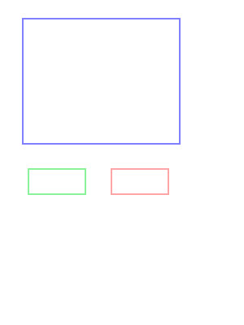

# Last inn bilde

## Litt kode for å plassere img-drop på bilde-rammen \(it2\).

Versjonen vi starter med er [https://github.com/audunhauge/jspaint/tree/v1.12](https://github.com/audunhauge/jspaint/tree/v1.12)

Jeg har lagt til en ny klasse under Shapes - den har navnet Picture.  
Tredje ikon fra toppen i verktøylinja lar deg tegne en firkant som er bilderammen.  
Etter at du har tegna den kan du trykke "liten L" mens peker er på denne rammen. Da vil du få fram et   
"last inn bilde skjema". Dette skjema kommer midt på skjermen og har fast størrelse.  
Dagens oppdrag er å få dette skjemaet til å ligge over bilderammen.

### 



```javascript
// ca linje 80 -100 fra denne filen
static l(obj) {
    if (SelectedShapes.list.length === 0) {
      // select shape under pointer
      const p = AT.mouse;
      const inside = drawings.filter((e) => e.contains(p));
      if (inside.length > 0) {
        const target = inside[inside.length - 1];
        if (target.isa("Picture")) {
          const np = g("newpage");         
          makeForm(
            np,
            "loadpic",
            () => {
              const loader = g("imgloader");
              
         // Ny kode
              const lf = g("loadfile");
              np.style.left = target.x + "px";
         //  mangler linjer for top,width,height
              loader.style.width = target.width + "px";
         //  må overstyre tre elementer
              lf.style.height = 32 + target.height + "px";
         // kunne vært enklere dersom vi endra html+css
        
              loader.addEventListener("change", e => {
                var output = document.createElement("img");
                output.src = URL.createObjectURL(event.target.files[0]);
                output.onload = function () {
                  const {width:tw, height:th} = target;
                  const {width,height} = output;
                  URL.revokeObjectURL(output.src); // free memory
                  const ctx = target.offscreenCanvas.getContext("2d");
                  ctx.drawImage(output, 0, 0,width,height,0,0,tw,th);
                  np.classList.add("hidden");
                  renderCanvas();
                };
              })
            },
            null
          );
        }
      }
    }
  }
```



```javascript
 // en dårlig løsning som følge av html+css som 
 // gjør det unødvendig vanskelig.
 // En bedre løsning krever endringer i css/html
  
 const lf = g("loadfile");
 const {width,height} = target;
 const left = (target.x - width/2 + 180) + "px";
 const top = (target.y - height/2 + 100) + "px";
 const w = Math.max(100,width) ;
 const h = Math.max(100,height) ;
 np.style.left = left ;
 np.style.top = top;
 np.style.width = w + "px";
 np.style.height = 32 + h + "px";
 loader.style.width = w + "px";
 loader.style.height = 32 + h + "px";
 lf.style.width = w + "px";
 lf.style.height = 32 + h + "px";
```



## Endring av css og html slik at koden kan forenkles \(it1\)

Vi har denne koden for skjemaet som laster opp bilder:



```markup
<template id="loadpic">
        <label id="loadfile" for="imgloader">Dropzone
          <input id="imgloader" type="file" accept="image/*">
        </label>  
        <div>
            <label><button id="ok">OK</button>
                <button id="cancel">Cancel</button>
            </label>
        </div>     
</template>
```



Problemet er at koden som tilpasser dette skjemaet slik at det passer oppå rammen som bildet skal være inne i blir komplisert. Vi kan forenkle arbeidet for "the coders" ved å endre html og css.  
Endre css/html slik at det er tilstrekkelig å endre bredde,høyde på ett element - de andre tilpasser seg denne størrelsen. Et problem kan være at endringer du gjør her kan spolere skjema for "New file".  
For eksempel kan du endre button slik at de ikke har så stor margin \( de kommer under hverandre dersom boksen de er inne i blir for liten\). Du kan da skrive en css-regel som er mer presis enn den som brukes for   
"New file".  Anta at du lager en div\#imgform inne i template\#loadpic. Resten av innholdet er uendra - bare flytta inn i denne nye div-en. Hvordan kan du skrive en regel som gjelder knappene inne i \#imgform og som er mer presis enn den som er vist under?



```css
#newpage > div button {
  margin: 2rem;
  width: 5rem;
}
```



```css
#imgform button { ... }  er IKKE mer presis

div#imgform button { ... } ER mer presis
```





Skissen viser omtrent hvordan skjema skal se ut. Den blå biten er \#loadfile, \#imgloader må ha samme størrelse. Hele skjema må ha plass til OK og Cancel under - de kommer utforbi bilderammen.  
Lag css-regler slik at vi får dette utseende. Du kan få god bruk for funksjonene **calc**, **clamp**, **max** og **min** i reglene du skriver. Vi ønsker ikke at skjema skal bli mindre enn 150 x 150 px.

