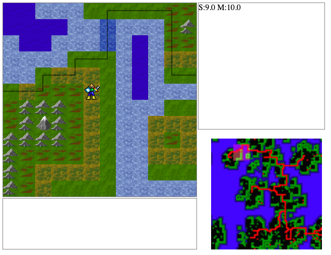

# World map

Det er et stort sprang siden sist - jeg har lagt til kode som lager et verdenskart.  
Foreløpig er verden 80x80 ruter - den består av ca 10 øyer som kan vokse sammen \(tilfeldig variasjon\). Du kan få separate øyer - eller sammenhengende landmasser.  
Jeg har lagt til en Stifinner-modul som finner veien fra et punkt til et annet på kartet - der det er mulig å gå \(bruker Astar algoritmen\).

Disse relativt store modulene kan vi betrakte som ferdig kode som bare skal kunne brukes - trenger ikke å forstå koden i detalj. Jeg har også fjerna en del moduler jeg testa ut for å lage kart - de var ofte basert på nodejs og medførte mange ekstra moduler. Går nå for en enkel hjemmesnekra modul som lager brukbare øyer som kart.



Så denne versjonen plasserer avataren på den første øyen og strør et antall goblins rundt på kartet. Den lager også en vei \(eget canvas overlay\) som lar deg gå fra øy til øy. Der hvor veien krysser havet er terrenget endra til å være "tidal mudflats" som kan passeres ved lavvann \(foreløpig er det alltid lavvann\). Dersom det er stor avstand mellom to øyer legges en liten holme mellom slik at det blir _litt_ mer troverdig.

Her er koden som brukes til å styre avataren - ser bort fra bevegelse:

```javascript
 switch (last) {
    case "a":  // attack
        const inrange = touchingMonsters(monsters,{x,y});
        for (let m of inrange) {
            m.alive = false;
            m.div.classList.add("dead");
            const {x,y} = m;
            map.clear(x, y)
        }
        break;
}
```

**inrange** vil være en liste over monster som berører avataren.   
Slik koden virker nå kan spilleren drepe alle monster med et one-hit attack.  
Vi ønsker å bruke standard løsning på kamp i d&d, spiller og monster må ha hitpoints, de må ha våpen som gir bonus til angrep og rustning som gir bonus til forsvar.  
Anta at spiller \(22hp\) har en attack på +2, et sverd som er 2d6 \(trill to 6er terninger\).  
Anta at monster \(15hp\) har defence på +1, en rustning på 1d3 \(trill en 3er terning\).  
For hvert angrep må vi da regne ut attack : +2 + 2d6 = 2+7 \(eksempel\) = 9  
Forsvar:  +1 +1d3 = 1 +1 = 2,    =&gt; attack blir da 9-2 = 7  
Monster taper da 7 hp og har 8hp igjen.  
Monster bør da ha sin tur til å angripe \(må legges i monster-klassen\).

Hvilke endringer og hvor må vi lage for å få dette til?

```javascript
// pseudokode  (lett blanding av norsk og js)

Antar at Player og Monster har egenskapene
{ hitpoints:22, attack:2, defence:2 } eller lignende.
Antar at begge har equipment:
{ armor: "2+2d4", weapon: "3+2d6" }
Ved angrep kan vi da gjøre følgende:
  let att = this.attack + getRoll(this.equipment.weapon);
  let def = monster.defence + getRoll(this.equipment.armor);
  if (att > def) {
     monster.hp -= att - def;
     if (monster.hp < 0) {
        monster.dies()
     }
  }
  
Trenger da getRoll(eqipment) 
  // antar at formen alltid er tall+terning
  const [base,dice] = eqipment.split("+");
  return Number(base) + diceRoll(dice);
  
Trenger da diceRoll(die)
  // antar dice = <tall>d<tall>, 3d6 2d12 1d6 osv
  const [number, size] = die.split("d").map(Number);
  // .map(Number) slik at vi får tallverdier
  // skal da kaste number terninger av typen size (6er terning)
  // og returnere summen
  const rolls = new Array(number).fill(0).map(e => dice(size))
  return rolls.reduce( (s,v) => s+v,0)
  
Trenger da dice(size)
   return Math.floor(Math.random()*size) + 1
   
En test på diceRoll er følgende:
diceRoll("12d1") === 12
diceRoll("2d6") >= 2
diceRoll("2d6") <= 12

NB! med skissen over kan vi ikke ha "cursed equipment" som gir
negative verdier till att/def
```

