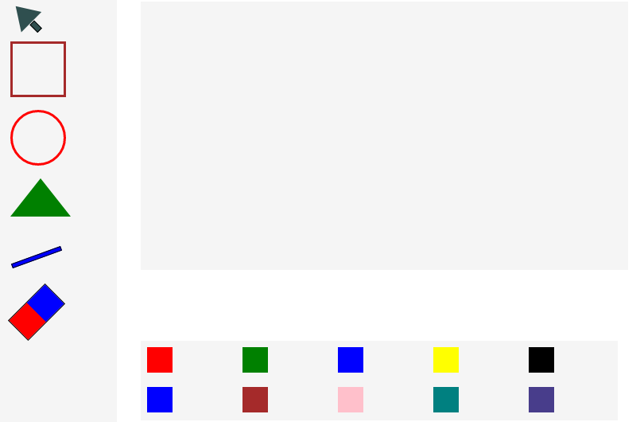
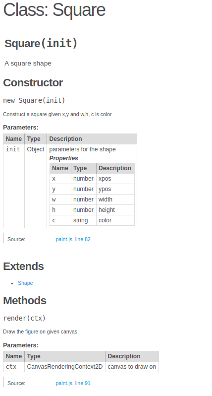

# Paint - design av gui

Vi skal lage en simple paint versjon, du kan hente første versjon fra [https://github.com/audunhauge/jspaint/tree/v1.0](https://github.com/audunhauge/jspaint/tree/v1.0)



På venstre side har vi verktøy - peker firkant polygon polyline og visk.  
Tegneområde \(canvas\) til høyre og fargevelgere nederst \(strek og fyll\).  
Oppgaven er å lage denne layouten med html + css. Alle verktøy er ren css, en div pr figur.  
Du finner en del hint under.



```css
/* Hopper over peker - den er litt komplisert.
   De som ikke er vist er rett fram (slik som sirkel - border-radius 50%)
   Eller kan lett utledes fra eksemplene.
   Peker ikke vist her.

Regelen for firkanten blir slik: */
#tools > div:nth-child(2) {
  border: solid brown 3px;
}

/*
For alle de andre bruker vi samme type selector: nth-child(x)
Du trenger bare bytte ut x med nr på den diven regelen skal styre
Prøv å lage løsning selv før du sjekker løsningsforslag
*/
```



```css
/* her bruker vi et triks - border rundt en firkant
   med 0 bredde og 0 høyde - alle sidene er transparent - bortsett 
   fra border-bottom - det er denne som blir trekanten
*/
  width: 0;
  height: 0;
  border-top: 0 solid transparent;
  border-left: 38px solid transparent;
  border-right: 38px solid transparent;
  border-bottom: 48px solid green;
```



```css
/* bruker gradient til å få to farger i en div, kan ha så mange dul vil */
#tools > div:nth-child(6) {
  width: 64px;
  height: 34px;
  background: linear-gradient(to right, red 0%, red 49%, blue 50%, blue 100%);
  transform: rotate(-45deg);
  margin-top: 3rem;
  margin-bottom: 3rem;
}
```



Sjekk ut html filen vist under. Som du ser så har vi en div med verktøy \(tools\), et canvas og fargevelger for outline og fill. I CSS er det vist litt styling for tools - spesielt den første div'en som skal være en peker.  
I JS er det vist to enkle classer \(dette er ikke pensum for it-1\). Du kan sjekke dem ut om du er interessert.




```javascript
 <div id="main">
        <div id="tools">
            <div title="pointer"></div>
            <div title="square"></div>
            <div title="circle"></div>
            <div title="polygon"></div>
            <div title="polyline"></div>
            <div title="eraser"></div>
        </div>
        <div id="draw">
            <canvas id="canvas" width="1024" height="800"></canvas>
        </div>
        <div id="colors">
            <div title="red"></div>
            <div title="green"></div>
            <div title="blue"></div>
            <div title="yellow"></div>
            <div title="black"></div>
        </div>
        <div id="fill">
            <div title="red"></div>
            <div title="green"></div>
            <div title="blue"></div>
            <div title="yellow"></div>
            <div title="black"></div>
        </div>
    </div>
```




```css

#tools > div {
  width: 64px;
  height: 64px;
  border: solid black 1px;
  margin: 1rem;
}

#tools > div:nth-child(1) {
  position: relative;
  width: 0;
  height: 0;
  border-top: 0 solid transparent;
  border-left: 18px solid transparent;
  border-right: 18px solid transparent;
  border-bottom: 28px solid darkslategrey;
  transform: rotate(-45deg) translate(2px, -4px);
}

#tools > div:nth-child(1):after {
  content: "";
  width: 12px;
  height: 6px;
  background-color: darkslategrey;
  position: absolute;
  transform: rotate(-90deg) translate(-32px, -7px);
  border: solid black 1px;
}
```



```javascript
class Point {
    /**
     * Create a point given x,y
     * @param {{x:number,y:number}} point (x,y)
     */
  constructor({ x, y }) {
    this.x = x;
    this.y = y;
  }
}

/**
 * A square shape
 */
class Square extends Point {
    /**
     * 
     * @param {{x:number,y:number,w:number,h:number,c:string}} w=width,h=height
     */
  constructor({ x, y, w, h, c }) {
    super({ x, y });
    this.w = w;
    this.h = h;
    this.c = c;
  }
  /**
   * Draw the figure on given canvas
   * @param {CanvasRenderingContext2D} ctx canvas to draw on
   */
  render(ctx) {
    ctx.beginPath();
    ctx.strokeStyle = this.c;
    ctx.strokeRect(this.x, this.y, this.w, this.h);
  }
}
```



## Koding - Nye klasser \(dette er it-2\)

**I denne økta skal vi se på bruk av klasser med arv. Vi ser også på automatisk generering av dokumentasjon. Paint programmet kan ikke tegne bedre etter disse endringene, men vi har lagt grunnlaget for senere utviding.**

I koden fra v1 har vi klassen Point og Square - som viser enkel arv. En Square har de samme egenskapene som et Point, men har w og h i tillegg. En Square kan også tegne seg selv med .render\(\) funksjonen.  
Under har jeg lagt til en del nye klasser og endra på hierarkiet - nå har vi  
  Point --  Shape -- Square  
En Shape er et Point med en farge i tillegg.   
_I andre språk ville en gjerne lagt til render\(\) som en virtuell metode her \(Java/C++\), eller laga denne klassen som en interface \(Go\) - eller enumeration \(Rust\) \)._

Nå kan klassene Square og Circle bygge på klassen Shape og de har automatisk støtte for farge \(slipper å gjenta dette for de to klassene\).  
Klassen Vector får vi bruk for når vi skal beregne radius gitt to punkter.  
Legg merke til bruken av Vector:  
`const v = new Vector( { x:10, y:6} );  
const p = new Point( { x:2 , y: 3});  
const w = v.add(p);  // w er en Vector`

v.add v.sub lager nye vektorer - de endrer ikke originalen - v.length\(\) beregner lengden.



```javascript
class Point {
  /**
   * Create a point given x,y
   * @param {{x:number,y:number}} point (x,y)
   */
  constructor({ x, y }) {
    this.x = x;
    this.y = y;
  }
}

```



```javascript
class Vector extends Point {
  constructor({ x, y }) {
    super({ x, y });
  }

  /**
   * Returns u+v where u,v are vectors
   * @param {Point|Vector} v 
   * @returns {Vector}
   */
  add(v) {
    return new Vector({ x: this.x + v.x, y: this.y + v.y });
  }

  /**
   * Returns u-v
   * @param {Point|Vector} v 
   * @returns {Vector}
   */
  sub(v) {
    return new Vector({ x: this.x - v.x, y: this.y - v.y });
  }

  /**
   * Calculates length of vector
   * @returns {number}
   */
  get length() {
    return Math.sqrt(this.x**2 + this.y**2);
  }
}
```



```javascript
class Shape extends Point {
  /**
   * (x,y) is a point, c is a color string
   * @param {{x:number,y:number, c:string}} xyc
   */
  constructor({ x, y, c }) {
    super({ x, y });
    this.c = c;
  }
}

```



```javascript
class Square extends Shape {
  /**
   * Construct a square given x,y and w,h, c is color
   * @param {{x:number,y:number,w:number,h:number,c:string}} w=width,h=height
   */
  constructor({ x, y, w, h, c }) {
    super({ x, y,c });
    this.w = w;
    this.h = h;
  }
  /**
   * Draw the figure on given canvas
   * @param {CanvasRenderingContext2D} ctx canvas to draw on
   */
  render(ctx) {
    ctx.beginPath();
    ctx.strokeStyle = this.c;
    ctx.strokeRect(this.x, this.y, this.w, this.h);
  }
}
```



```javascript
class Circle extends Shape {
  /**
   * Construct circle given x,y,r and c=color
   * @param {{x:number,y:number,r:number,c:string}} xyrc
   */
  constructor({ x, y, r, c }) {
    super({ x, y,c });
    this.r = r;
  }
  /**
   * Draw the figure on given canvas
   * @param {CanvasRenderingContext2D} ctx canvas to draw on
   */
  render(ctx) {
    ctx.beginPath();
    ctx.strokeStyle = this.c;
    ctx.arc(this.x, this.y, this.r, 0, 2 * Math.PI, false);
    ctx.stroke();
  }
}
```



I eksemplene over har jeg lagt til dokumentasjon etter jsdoc-standarden. I vs-code har det den fine fordelen at code-completion/intellisence bruker jsdoc kommentarene til å gi hjelp.  
VScode vil også markere som feil dersom jeg prøver v.sub\(12\) da sub\(\) forventer en Vector eller Point som parameter. Uten jsdoc får jeg ikke disse feilmeldingene.  
_Noen vil nok her anbefale bruk av TypeScript eller Flow, men ønsker å vise at vanilla js kan støtte typer._  
I VSCode kan du også installere et addon som automatisk generer dokumentasjon ut fra slike jsdoc kommentarer - jeg bruker "Preview JSDOC" som fungerer greit \(kan forbedres\).

I bildet under ser du dokumentasjon generert av jsdoc preview:



Dette genereres automatisk når du saver en js fil med jsdoc - kommentarer.

Link til denne versjonen: [https://github.com/audunhauge/jspaint/tree/v1.2](https://github.com/audunhauge/jspaint/tree/v1.2)

