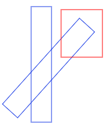

# En bedre select versjon \(it2\)

Bruker skal kunne velge shapes med peker - løsningen vi har nå er mildt sagt dårlig. Første versjon var at vi tegna en firkant og fant overlap mellom alle Shapes og denne firkanten \(Shape.overlap \).  
Dette virka fint for uroterte firkanter, ikke veldig bra for sirkler \(men som omtrent\).  
Problemet oppstår når vi tillater roterte firkanter \(og andre figurer\).   
Illustrasjonen under er laga med Paint.js \(v1.8\).



For å komme enkelt ut av denne knipa laga jeg en ny test som sjekker senter + radius for hver figur for overlap. Problemet er selvsagt at da får jeg overlap mellom den røde og begge de blå - radius er slik at hele firkanten er inni, senter midt i firkanten.

## Overlap mellom polygoner

Dette er da den mer generelle metoden - gitt to polygon \(minst trekant\) - true/false dersom de overlapper.  
Jeg googla og fant følgende kode:



```javascript
function polygonPolygon(points1, points2)
{
    var a = points1
    var b = points2
    var polygons = [a, b]
    var minA, maxA, projected, minB, maxB, j
    for (var i = 0; i < polygons.length; i++)
    {
        var polygon = polygons[i]
        for (var i1 = 0; i1 < polygon.length; i1 += 2)
        {
            var i2 = (i1 + 2) % polygon.length
            var normal = { x: polygon[i2 + 1] - polygon[i1 + 1],
                           y: polygon[i1] - polygon[i2] }
            minA = maxA = null
            for (j = 0; j < a.length; j += 2)
            {
                projected = normal.x * a[j] + normal.y * a[j + 1]
                if (minA === null || projected < minA)
                {
                    minA = projected
                }
                if (maxA === null || projected > maxA)
                {
                    maxA = projected
                }
            }
            minB = maxB = null
            for (j = 0; j < b.length; j += 2)
            {
                projected = normal.x * b[j] + normal.y * b[j + 1]
                if (minB === null || projected < minB)
                {
                    minB = projected
                }
                if (maxB === null || projected > maxB)
                {
                    maxB = projected
                }
            }
            if (maxA < minB || maxB < minA)
            {
                return false
            }
        }
    }
    return true
}
```



```javascript
/**
 * polygon-circle collision
 * @param {number[]} points [x1, y1, x2, y2, ... xn, yn] of polygon
 * @param {number} xc center of circle
 * @param {number} yc center of circle
 * @param {number} rc radius of circle
 */
function polygonCircle(points, xc, yc, rc)
{
    if (polygonPoint(points, xc, yc))
    {
        return true
    }
    var count = points.length
    for (var i = 0; i < count - 2; i += 2)
    {
        if (lineCircle(points[i], points[i + 1], 
                       points[i + 2], points[i + 3], xc, yc, rc))
        {
            return true
        }
    }
    return lineCircle(points[0], points[1], points[count - 2], 
                      points[count - 1], xc, yc, rc)
}
```



```javascript
/**
 * line-circle collision
 number @param {number} x1 point 1 of line
 number @param {number} y1 point 1 of line
 number @param {number} x2 point 2 of line
 number @param {number} y2 point 2 of line
 number @param {number} xc center of circle
 number @param {number} yc center of circle
 number @param {number} rc radius of circle
 */
function lineCircle(x1, y1, x2, y2, xc, yc, rc)
{
    var ac = [xc - x1, yc - y1]
    var ab = [x2 - x1, y2 - y1]
    var ab2 = dot(ab, ab)
    var acab = dot(ac, ab)
    var t = acab / ab2
    t = (t < 0) ? 0 : t
    t = (t > 1) ? 1 : t
    var h = [(ab[0] * t + x1) - xc, (ab[1] * t + y1) - yc]
    var h2 = dot(h, h)
    return h2 <= rc * rc
}

function dot(v1, v2)
{
    return (v1[0] * v2[0]) + (v1[1] * v2[1])
}
```



```javascript
/**
 * polygon-point collision
 * based on https://stackoverflow.com/a/17490923/1955997
 * @param {number[]} points [x1, y1, x2, y2, ... xn, yn] of polygon
 * @param {number} x of point
 * @param {number} y of point
 * @param {number} [tolerance=1] maximum distance from edge
 */
function polygonPoint(points, x, y, tolerance)
{
    var length = points.length
    var c = false
    var i, j
    for (i = 0, j = length - 2; i < length; i += 2)
    {
        if (((points[i + 1] > y) !== (points[j + 1] > y))
         && (x < (points[j] - points[i]) 
            * (y - points[i + 1]) / (points[j + 1] - points[i + 1]) 
            + points[i]))
        {
            c = !c
        }
        j = i
    }
    if (c)
    {
        return true
    }
    for (i = 0; i < length; i += 2)
    {
        var p1x = points[i]
        var p1y = points[i + 1]
        var p2x, p2y
        if (i === length - 2)
        {
            p2x = points[0]
            p2y = points[1]
        }
        else
        {
            p2x = points[i + 2]
            p2y = points[i + 3]
        }
        if (linePoint(p1x, p1y, p2x, p2y, x, y, tolerance))
        {
            return true
        }
    }
    return false
}
```



Problemet er nå å ta disse i bruk.  
Dette er kompetansemålet  fra læreplanmålene:  
  _lage egne og bruke egne og andres_ [_funksjoner_](../it3/funksjoner.md) _eller metoder med parametere_

### Polygon Polygon

Merk at det er ikke nødvendig å forstå **hvordan** funksjonen virker - bare **hva** den gjør.  
Gitt to polygon - hver definert av en array med Points - sjekker om de har overlap.  
Metoden krever en del matematikk - vektor-regning osv.  
Legg merke til at antall beregninger blir ca `n * m` - n,m er antall punkt i polygon N og M.  
Den ytre for-løkka kjøres to ganger \(sjekker to polygon mot hverandre\).  
For to firkanter vil den ikke være mye tregere enn bounding-box, men for polygon med mange punkt vil dette ta tid.

### Polygon Circle

Denne ser enklere ut -hovedsaklig fordi den har delegert mye av arbeidet til LineCircle og PolygonPoint.  
Under viser jeg forsøk på å forstå andres kode - den siste ga jeg opp - bare håper at den virker .



```text
// litt pseudocode
dersom srikelens senter er inne i polygonet da er det overlap
ellers må vi sjekke overlap mellom hver linje i polygonet og sirkelen
   for hvert par med punkt
   sjekk om linja overlapper sirkelen
      gi tilbake true dersom
   sjekk også første og siste punkt (et lukket polygon)
```



```
// pseudocode
finner vektor ac fra center til p1
finner vektor ab fra p1 til p2
ab2 er ab*ab = |ab|²
acab er ac*ab = |ac|*|ab|*cos(vinkel mellom)
t er acab/ab2 = |ac|*cos() / |ab|

Nå googla jeg og fant denne forklaringen:
(ser ikke ut som det er helt samme framgangsmåte, men nesten)
Som sagt - vi behøver ikke forstå koden - men bør teste at den virker
på en del eksempler ...

Taking
E is the starting point of the ray,
L is the end point of the ray,
C is the center of sphere you're testing against
r is the radius of that sphere
Compute:
d = L - E ( Direction vector of ray, from start to end )
f = E - C ( Vector from center sphere to ray start )

Then the intersection is found by..
Plugging:
P = E + t * d
This is a parametric equation:
Px = Ex + tdx
Py = Ey + tdy
into
(x - h)2 + (y - k)2 = r2
(h,k) = center of circle.

to get:

Expand
x2 - 2xh + h2 + y2 - 2yk + k2 - r2 = 0
Plug
x = ex + tdx
y = ey + tdy
( ex + tdx )2 - 2( ex + tdx )h + h2 + 
    ( ey + tdy )2 - 2( ey + tdy )k + k2 - r2 = 0
Explode
ex2 + 2extdx + t2dx2 - 2exh - 2tdxh + h2 + ey2 + 2eytdy + 
   t2dy2 - 2eyk - 2tdyk + k2 - r2 = 0
Group
t2( dx2 + dy2 ) + 2t( exdx + eydy - dxh - dyk ) 
    + ex2 + ey2 - 2exh - 2eyk + h2 + k2 - r2 = 0
Finally,
t2( _d * _d ) + 2t( _e * _d - _d * _c ) 
   + _e * _e - 2( _e*_c ) + _c * _c - r2 = 0
*Where _d is the vector d and * is the dot product.*
And then,
t2( _d * _d ) + 2t( _d * ( _e - _c ) ) + ( _e - _c ) * ( _e - _c ) - r2 = 0
Letting _f = _e - _c
t2( _d * _d ) + 2t( _d * _f ) + _f * _f - r2 = 0
So we get:
t2 * (d DOT d) + 2t*( f DOT d ) + ( f DOT f - r2 ) = 0

 a = d.Dot( d ) ;
 b = 2*f.Dot( d ) ;
 c = f.Dot( f ) - r*r ;

float discriminant = b*b-4*a*c;
if( discriminant < 0 )
{
  // no intersection
}
```



```
// denne skjønner jeg ikke ut fra koden
// her må du søke opp en forklaring dersom du trenger det.

sjekker bare om koden ser ut til å virke -- forstår itno
```



Prøv om dere kan bruke denne løsningen istedenfor overlap/touching.  
~~Løsning finner dere som v1.9 \(legges ut snart\)~~

## Forsøk på implementering

Jeg starta med å endre Square slik at den kan levere fra seg en array med punkt slik som kreves for polygonPolygon, men ser da at dette ikke vil virke bra dersom firkanten er rotert. Da må punktene omregnes slik at vi får med rotasjonen.  
Jeg tenker at det er lettere å lage et generelt Polygon \(en firkant er en variant\) som støtter rotasjon på den måten at koordinatene til punktene beregnes ut fra gitt vinkel. Polygonet lagrer bare punktene - ikke rotasjonen. En rotasjon endrer bare punktene.  
Fordelen er jo da at trekanter, firkanter og andre polygon kommer direkte ut av denne løsningen.

