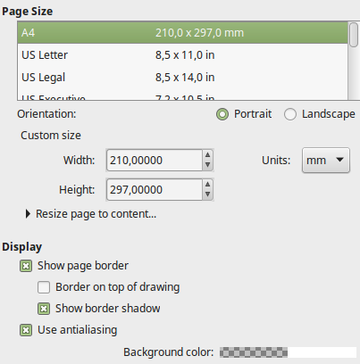

# Hente data fra "New file" skjema

It-1 fikk oppdraget med å lage et skjema hvor en bestemmer layout for ett nytt tomt ark \(New File\).  
Oppdraget i dag er å legge til kode som leser inn verdiene fra skjemaet og setter verdiene slik at det nye arket stemmer med brukervalgene.

Skjemaet har omtrent denne utformingen:



Her er html som brukes i skjemaet - og koden for  å starte et nytt ark.  
Oppdraget er å skrive kode som leser verdiene fra skjema og setter css-variablene slik at brukervalgene tar effekt.



```markup
<template id="form">
    <div><label>Page size<select name="pagesize" id="pagesize">
        <option value="A4">A4</option>
        <option value="A5">A5</option>
        <option value="A3">A3</option>
        <option value="letter">letter</option>
    </select></label></div>
    <div><label>Orientation: <input name="orientation" type="radio"> Portrait
         <input name="orientation" type="radio"> Landscape</label></div>
    <div><label>Width 
        <input type="number" id="width" value="500"></label></div>
    <div><label>Height 
        <input type="number" id="height" value="500"></label></div>
    <div><label>Color <input type="color" id="color"></label></div>
    <div><label>Fill <input type="color" id="color"></label></div>
    <div><button id="ok">OK</button></div>
    <div><button id="cancel">Cancel</button></div>
</template>
```



```javascript
function startNewPage() {
  const np = g("newpage");
  np.classList.remove("hidden");
  const template = /** @type {HTMLTemplateElement} */ (g("form"));
  const clone = template.content.cloneNode(true);
  np.innerHTML = "";
  np.append(clone);

  const btnCancel = g("cancel");
  btnCancel.addEventListener("click", (e) => {
    np.classList.add("hidden");
  });

  const btnOK = g("ok");
  btnOK.addEventListener("click", (e) => {
    np.classList.add("hidden");
    cleanGhost();
    cleanCanvas();
    AT.color = "blue";
    AT.fill = "transparent";
    drawings = [];
    SelectedShapes.list = []; // no selected shapes
    // code to read values form form
  });
}
```



```css
:root {
  --line: black;
  --fill: red;
  --backgrnd: white;
  --width: 1024px;
  --height: 800px;
}

#canvas {
  width: var(--width);
  background-color: var(--backgrd);
  ...
}
```



```javascript
document.documentElement.style.setProperty("--backgrnd", "transparent");
```

Denne kodebiten oppdaterer en css variabel. Kan brukes til å endre bakgrunnsfarge osv.  
Forutsetter at css har de egenskapene som skal endres i :root



