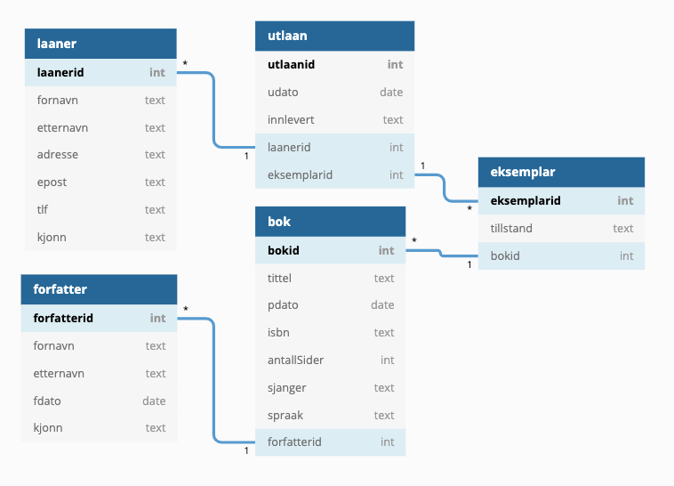

# Databaser

## PostgresSQL

Først lager vi en ny mappe i vs-code med navnet bibliotek.  
I denne mappa lager vi filen **bib.sql** som vi skal bruke gjennom hele eksemplet.  
Installer **SQLTools** extension i visual studio.

Postgres er en database-server som vi kan installere på egen maskin eller på en hosted-server.  
På mac søker vi på _install postgres mac_ og installerer postgres.app.  
Etter at den er satt opp riktig kan vi starte opp programmet.  
På **mac** starter vi postgress.app - da får vi et vindu som viser databasene vi har laga.  
  -  Første gang finner vi bare **postgres** som alltid er tilstede.  
På **windows** går vi inn på Programmer og blar ned til postgres og finner **sql-shell**.  
  -  du kan trykke enter på alle alternativer \(skriv inn passord dersom du valgte et\).

### Lag en ny database



```sql
Dobbeltklikk på databasen postgres (inne i postgres.app) 
og du får fram et kommandovindu.
```



```
Du er allerede inne i kommandovinduet (sql-shell).
```



Skriv som vist under:

```sql
create role bib password '123';
alter role bib with login;
create database bib owner bib;
```

Legg merke til at linjene slutter med semikolon, ingenting skjer dersom denne ikke er med.  
Vi har nå laga en ny database med navnet bib som eies av brukeren bib med passord 123 og som kan logge inn på serveren \(database-serveren\).

Fra postgres.app kan vi nå åpne den nye databasen.  
På **windows** stenger vi sql-shell og åpner det på nytt, nå skriver vi inn bib som bruker/database og 123 som passord.

Vi definerer nå tabellen **bok** og tabellen **forfatter**. Åpne **bib.sql** i vs-code

```sql
CREATE TABLE forfatter (
  forfatterid serial primary key,
  fornavn text not null,
  etternavn text not null,
  fdato date,
  kjonn text check (
    kjonn = 'm'
    or kjonn = 'f'
  )
);

CREATE TABLE bok (
  bokid serial primary key,
  tittel text not null,
  pdato date,
  isbn text,
  antallSider int check (antallsider > 0),
  sjanger text,
  spraak text,
  forfatterid int references forfatter (forfatterid)
);
```

Lag en ny kobling til databasen i vs-code: "ctrl+shift+p"  skriv _sqladd_ og velg  
SQL Tools Managment: Add New Connection.  
Gi koblingen navnet bib, databasen er bib, bruker er bib og passord 123.  
Klikk på **Save Connection**.

### Kjør sql kommandoer

Marker all tekst i bib.sql og trykk \(cmd+e cmd+e\) eller \(cmd+shift+p sqlrunsel \).  
Create table kommandoene blir nå kjørt i postgres - med litt flaks skal alt virke.

### Legge inn data \(insert-spørring\)

Vi kan nå registrere \(legge inn\) forfattere på denne måten i kommando-vinduet.

```sql
insert into forfatter (fornavn, etternavn) values ('leo','tolstoj');
# merk at vi MÅ bruke hermetegnet '  du kan ikke bruke "
# legg inn flere forfattere ved å trykke pil opp og så rediger verdiene

# vi kan velge ut alle forfattere fra tabellen slik:
select * from forfatter
# viser alle registrerte forfattere
```

Vi kan også gjøre det fra vs-code, skriv inn linje 1 og 6 i bib.sql, marker begge linjene og kjør kommandoene med \(cmd+e cmd+e\) som vist over \(Kjør sql kommandoer\).

### Velge ut data \(spørring\)

```sql
select * from forfatter where fornavn ~ 'ole';
// finner alle forfattere som har fornavn som ligner på 'ole'

select tittel,antallSider from bok where tittel ~ 'krig';
//  bøker som inneholder 'krig' i tittelen
```

### Slette data \(slette-spørring\)

```sql
delete from forfatter where fornavn ~ 'ole';
// sletter alle forfattere som har navn som ligner på 'ole'

delete from bok where tittel ~ 'krig';
// sletter alle bøker som inneholder 'krig' i tittelen
```

### Velge fra to tabeller \(inner join\)

```sql
select b.tittel, f.fornavn from bok b inner join forfatter f 
       on (b.forfatterid = f.forfatterid)
       where b.tittel ~ 'krig';
// finner tittel,forfatternavn for alle bøker 
// som har en tittel som inneholder 'krig'       
```

For å koble sammen to tabeller i en spørring bruker vi **inner join**.  
Spørringen kobler sammen tabellene bok og forfatter \(de har en relasjon\) og finner verdiene som hører sammen.

## Database - diagram

Vi bruker [dbdiagram](https://dbdiagram.io) til å tegne diagrammer som viser hvordan tabellene er kobla. Følg linken og klikk på Go To App. Du kan logge inn med github brukeren din. Marker de to tabellene vi har laga i bib.sql, kopier, gå inn på dbdiagram, lag nytt diagram, velg import - postgres og lim inn.

Du har nå laga de to første tabellene i modellen. Vi skal lage følgende tabeller i tillegg:   **laaner**, **eksemplar** og **utlaan**.



Du kan lage de tre nye tabellene i bib.sql og importere dem til dbdiagram.io, eller du kan lage dem i dbdiagram og eksportere som fil \(denne kan du kopiere til bib.sql\). Du kan lage koblingene mellom tabellene ved å dra nøkkelfelt fra en tabell bort til tilsvarende fremmednøkkel i en annen tabell.

### Ferdig versjon av bib.sql

```sql
-- drop table bok,laaner,forfatter,eksemplar,utlaan cascade;

CREATE TABLE laaner (
  laanerid serial primary key,
  fornavn text not null,
  etternavn text not null,
  adresse text,
  epost text,
  tlf text,
  kjonn text
);

CREATE TABLE forfatter (
  forfatterid serial primary key,
  fornavn text not null,
  etternavn text not null,
  fdato date,
  kjonn text check (
    kjonn = 'm'
    or kjonn = 'f'
  )
);

CREATE TABLE bok (
  bokid serial primary key,
  tittel text not null,
  pdato date,
  isbn text,
  antallSider int check (antallsider > 0),
  sjanger text,
  spraak text,
  forfatterid int references forfatter (forfatterid)
);

CREATE TABLE eksemplar (
  eksemplarid serial primary key,
  tillstand text,
  bokid int references bok (bokid)
);

CREATE TABLE utlaan (
  utlaanid serial primary key,
  udato date,
  innlevert text default 'nei' check (
    innlevert = 'ja'
    or innlevert = 'nei'
  ),
  laanerid int references laaner (laanerid),
  eksemplarid int references eksemplar (eksemplarid)
);
```

