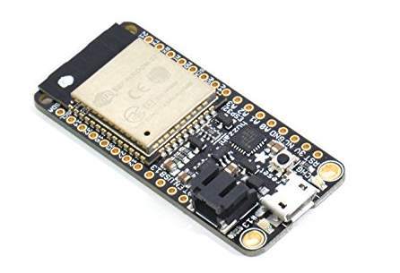
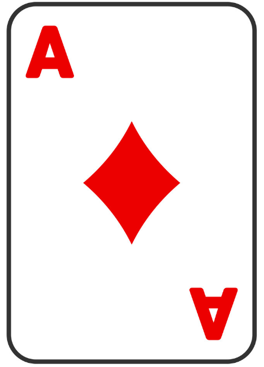

# Øvingsoppgaver

## Lag et klassebilde


Oppgaven er å legge et grid over bildet slik at hver person får en gul firkant i nærheten av ansiktet. Under finner du en css som kommer et stykke på vei.  
Din oppgave er å tilpasse css reglene slik at firkantene kommer nærmere ansiktene. Det er tilstrekkelig at firkanten delvis overlapper ansiktet.  
Merk at bakerste rad har 11 personer - der kan du legge til en egen firkant \(utenom grid-et\).



```css
#astro {
   
    background-image: url(../bilder/astro.jpg);
    background-position: center;
    background-repeat: no-repeat;
    width: 800px;
    height: 477px;
}

#fjes {
    position: relative;
    left: 82px;
    top:51px;
    display: grid;
    grid-template-columns: repeat(10, 1fr);
    height: 200px;
    width: 688px;
}

.fjes {
    position: relative;
    width: 20px;
    height: 20px;
    border: solid yellow 1px;
}

.fjes:nth-child(n + 11) {
   left: 13px;
}

.fjes:nth-child(n + 21) {
    left: -24px;
    top: -28px;
 }

 .fjes:nth-child(n + 24) {
    left: -1px;
    top: -13px;
 }
```



```markup

<body>
    <div id="astro">
        <div id="fjes">
            <div class="fjes"></div>
            ... (3*10)
```



```javascript
function setup() {
  let lyd = document.getElementById("lyd");
  let divAstro = document.getElementById("astro");
  divAstro.addEventListener("click", spill);
 
  function spill() {
    lyd.play();
  }
}
```



Du må lage et nytt prosjekt og legge inn filene over.  
Sørg for at mappe-strukturen stemmer med url i css.

Bruk egenskapen title i div elementene slik at navn på astronautene vise ved peker over \(dette skjer automatisk for element som har title\).

Lag en animasjon for rutene \(.fjes\) slik at firkantene blir til rundinger - varighet 1s  
ved :hover  \(muspeker over firkanten\).

Bruk filen under til å legge til et audio element. Sørg for at det har id="lyd".  
Javascriptet vil spille av lyden ved klikk på bakgrunnen.



## Lag en julekalender

### Kalender i html og css

Bruk bildet under som et utgangspunkt for å lage en julekalender med 24 luker som kan åpnes.


Bruk grid til å plassere 24 diver over bakgrunnsbildet. Hver div skal vise et tall fra 1 til 24.  
Ved klikk på en div skal du vise et nytt bilde i en div \(som ellers er skjult\).

Du trenger da 24 bilder som skal vises \(en for hver luke\). De skal være mindre enn bakgrunnen og skal navngis som bilde1.jpg ... bilde24.jpg

Koden under ordner åpningen av luker ved klikk.  
Forutsetningen for at den skal virke er at du har en div med id="vis", alle lukene har class="luke", alle bildene er navngitt som nevnt og at du har css regler som passer.



```javascript
function setup() {
  let divVis = document.getElementById("vis");
  let lukene = Array.from(document.querySelectorAll(".luke"));
  lukene.forEach( e => e.addEventListener("click", visLuke);
  
  function visLuke(e) {
    let t = e.target;
    let nr = Number(t.innerHTML);
    divVis.style.backgroundImage = `url("bilde${nr}.jpg")`;
    divVis.style.opacity = "1.0";
    setTimeout(() =>  divVis.style.opacity = "0.0", 2000);
  }
}
```



```text

```

## **HTML CSS \(grid og bilder\)**

Du skal lage et nytt prosjekt med følgende mappestruktur:

```text
Avatar
 |------ Bilder
 |         |-- aa00.png
 |         |-- aa01.png 
 :         :    
 :         |-- aa15.png
 |
 |-- avatar.html           
 |-- avatar.css
```

Over er alle navn med stor forbokstav mapper, Bilder inneholder aa00.png ... aa15png \(16 bilder\).

Last ned bildene under inn i mappa Bilder \(høyre-klikk og lagre som - de har navn aa00 ... aa15 \)

|  |  |  |  |
| :--- | :--- | :--- | :--- |
|  |  |  |  |
|  |  |  |  |
|  |  |  |  |

Du skal nå lage en html side **avatar.html** med standard oppsett.

1. Set tittel på dokumentet
2. Link til avatar.css

Legg inn følgende html:

```text
 <div id="main">
        <div id="avatar">
            <div></div>
            ..
            ..
        </div>
</div>
```

Div\#avatar skal inneholde 16 div-er.

Lag **avatar.css** og lag regler slik at:

1. \#avatar bruker grid \(4 kolonner\)
2. alle div-er inne i \#avatar har riktig bakgrunnsbilde \(+ for bruk av nth-of-type \)
3. Fellesregel for alle div inne i \#avatar \(dvs samle det som er felles for alle avatr-bildene inne i _en_ regel\)

## Animasjon med spritesheet



Bruk dette bildet til å lage en animasjon

Lag en div med passende dimensjoner for en frame \(et bilde i en film kalles en frame\) fra bildet \(150 x 200\).  
Lag en css-animasjon slik at dette bildet glir over skjermen \(ca 4s\).

## Sjakkbrikker i html og css

Lag en ny mappe med navnet **sjakk** - lag sjakk.html og start som vanlig med !

```text
#brett
   div*64
```

I koden over bruker jeg emmet til å lage en div\#brett som inneholder 64 div-er  
Legg til en css og bruk denne regelen for \#brett:

```css
#brett {
    border: solid black 1px;
    width: calc(50px * 8);
    height: calc(50px * 8);
    display: grid;
    grid-template-columns: repeat(8, 1fr);
}

#brett > div {
    position: relative;
    width: 50px;
    height: 50px;
    background-color: white;
}
```

Lag regler slik at du får et sjakkbrett - under er en del hint.  
Disse reglene lager et sjakkbrett hvor de to første radene er korrekt.  
Pønsk ut variasjoner av disse slik at hele brettet bilr riktig \(endre på tallene +9 og +10\)

```css
#brett div:nth-child(odd) {
    background-color: gray;
} /* annen hver rute blir grå - virker for første rad*/

#brett div:nth-child(2n+9) {
    background-color: white;
}   /* regel som fikser andre rad */
#brett div:nth-child(2n+10) {
    background-color: gray;
}
```

Neste trinn er å få vist brikkene, css reglene under lager en bonde dersom vi setter class="bonde"

```css
div.bonde:after {
    content: "";
    position: absolute;
    top:30px;
    left: calc((50px - 30px) / 2);
    width: 30px;
    height: 10px;
    background-color: whitesmoke;
    border-radius: 3px;
    box-shadow: 2px 2px 2px gray;
}

div.bonde:before {
    content: "";
    position: absolute;
    top:5px;
    left: calc((50px - 25px) / 2);
    width: 25px;
    height: 30px;
    background-color: whitesmoke;
    border-radius: 50%;
    box-shadow: 2px 2px 2px gray;
}

div.bonde.svart:before {
  background-color: black;
  box-shadow: 2px 2px 22px white
}

div.bonde.svart:after {
    background-color: black;
    box-shadow: 2px 2px 20px white
 }
```

Lag tilsvarende regler slik at du kan vise et komplett sjakkbrett.

## Komplett datamaskin

Du skal lage en nettside som selger komponenter til datamaskiner.  
Brukeren skal kunne velge mellom fem forskjellige hovedkort.  
Deretter skal hun kunne velge CPU og RAM som passer \(sjekk at dette stemmer\).  
Bruker skal kunne velge SSD og/eller Harddisk.

### Valg av operativsystem

Bruker skal kunne velge mellom fem forskjellige operativsystem \(windows + 4 linux varianter\).  
Dersom windows velges skal han kunne velge mellom 2 typer \(home/pro\).  
Dersom linux da er valget ubuntu, debian, linux-mint eller kali.

### Utforming

Butikken skal ha en felles menylinje \(lik for alle sidene\).  
På 1. side må bruker velge hovedkort  
   Her må du vise informasjon om de forskjellige typene.  
På 2. side velges CPU og RAM  
   Ta med beskrivelse av CPU og RAM \(virkemåte og forskjell på typer\)  
På 3. side velges SSD og/eller hdd  
   Ta med info slik at det blir lett for bruker å ta et begrunna valg.  
På 4. side velges operativsystem.  
   Beskriv de forskjellige OS - ta med pris  
Til slutt en side hvor bruker må skrive inn navn, adresse og betalingsinfo.  
Brukeren må velge mellom å bygge selv, eller at maskinen skal monteres.

### Lagring av bestilling

Lag en erd-modell som kan brukes til å lagre data om maskinen som skal bygges.  
Her tenker vi mest på tekniker som skal bygge maskinen \(oversikt over komponenter\).

## Quiz i ren css \(nesten\)

Vi skal prøve å lage en quiz i ren html og css. Poengberegning kan vi ikke løse uten javascript, men navigering og retting \(vis riktig/feil svar\) kan vi få til med bare html og css.  
Planen er at spørsmålene vises ett om gangen og at en kan bla til neste spørsmål - det skal ikke være mulig å ombestemme seg \(et kryss kan ikke fjernes\) da en ellers lett kan "sjekke" alle alternativer.  
En skal heller ikke kunne bla tilbake \(dette bare for å vise hvordan en slik sperre kan lages\).

### HTML for en quiz

Vi lager en enkel html og css med følgende innhold:



```markup
<div class="quiz" id="quiz">
  <label class="qnum count" for="r1">Qnr</label>
      <input type="radio" name="r" id="r1" checked />
      <div class="question count">
        <h4>Hvilke land er med i EU</h4>
        <ul>
          <li>
            <label for="">Holland</label>
            <input class="riktig" type="checkbox" />
            <label for="">Riktig</label>
          </li>
          <li>
            <label for="">Spania</label>
            <input class="riktig" type="checkbox" />
            <label for="">Riktig</label>
          </li>
          <li>
            <label for="">UK</label>
            <input type="checkbox" />
            <label for="">Tja litt usikkert</label>
          </li>
          <li>
            <label for="">Norge</label>
            <input type="checkbox" />
            <label for="">Galt</label>
          </li>
          <li>
            <label for="">Danmark</label>
            <input class="riktig" type="checkbox" />
            <label for="">Riktig</label>
          </li>
          <li>
            <label for="">Russland</label>
            <input type="checkbox" />
            <label for="">Galt</label>
          </li>
        </ul>
      </div>
</div>
```



```css
input[type="checkbox"] + label {
  opacity: 0;
}

input[type="checkbox"]:checked + label {
  opacity: 1;
}
```



HTML koden vår lager en div.quiz for hele quizen, hvert spørsmål ligger inne i en div.question.  
Spørsmålet ligger i en H4, svaralternativene i en ul.  
Alternativene bygges opp av en &lt;label&gt; med teksten som skal velges, en &lt;input\[checkbox\]&gt; og en ny label med tekst for tilbakemelding. Riktiv svar er markert med klasse for input-elementet \(riktig\).

I CSS lager vi en regel som skjuler tilbakemelding for alternativer som ikke er valgt \(opacity 0/1\).

Legg til flere spørsmål \(kopier hele div.question og rediger\). Legg til minst tre nye.

### Nummerering av spørsmål

Vi ønsker at alle spørsmål skal vises med "Question 1" og nummereres automatisk \(1,2,3 ... \).  
Under er en del hint \(og løsnigsforslag\). Prøv selv før du sjekker løsning.



```text
google følgende:
  css counter
  css before
```



```css
/* lag en ny teller som starter på 0 
   navnet (rnum) kan du velge helt fritt
   rnum fordi det er radio nummer n (antall radioknapper)
*/
div.quiz {
  counter-reset: rnum 0;
}

div.question.count::before {
  content: "Question " counter(rnum);
  font-size: 1.2em;
  color: blue;
}

/* øk verdien på telleren */
div.question.count {
    counter-increment: rnum;
}
```



### Vise/skjule tilbakemelding for alternativer

Vi skal nå skrive en regel i css slik at tilbakemelding blir vist for valgte alternativer. I CSS har vi to selectors som velger siblings \(søsken\) - dvs elementer som er barn av samme element og som er inntil hverandre \(+\) eller bare søsken \(~\).

**input + label** vil velge en label som følger **rett etter** en input \(vi kan bare velge element som følger i html - ikke tidligere element\).   
**input ~ label** vil velge alle element\(label\) som følger etter input \(og er barn av samme element som denne\).  
**input:checked** vil velge alle input elementer som er markert med kryss \(valg\).  
Du kan bruke opacity:0 til å skjule en tekst, opacity:1 for å vise \(unngår reflow\).

Bruk teknikkene over til å lage regler slik at tilbakemelding vises ved valg av svar-alternativ.



```text
Prøv selv før du sjekker løsningsforslag.
google
  css sibling selector
  css input checked
```



```css

input[type="checkbox"] + label {
  opacity: 0;
}

input[type="checkbox"]:checked + label {
  opacity: 1;
}
```




### Vise ett spørsmål om gangen - velg spørsmål med radioknapp

Vi bruker nesten samme teknikk til å vise ett spørsmål om gangen.  
Vi lager en regel som skjuler alle div-er som kommer etter en input\[type="radio\].  
Vi lager en ny regel \(som er mer presis/spesifikk\) som viser div rett etter en input\[type="radio"\] som er checked \(valgt\). Husk at dersom to regler krangler - så vinner den mest presise.



```text
Prøv selv først!
Bruk sibling selector +
```



```css
input[type="radio"] + div {
  display: none;
}
input[type="radio"]:checked + div {
  display: block;
  margin-top: 50px;  /* gir plass til ::before */
}
```



Link til ferdig versjon \(med en del forbedringer\)  [demo](https://audunhauge.github.io/it1/Quiz/quiz.html) .

## Designoppgave - kortstokk

### Ruter-ess

Du skal lage en kortstokk i html/css  
Lag først ruter-ess som vist i bildet.  
Dimensjonene skal være 89mm x 57mm




### Framgangsmåte

Lag som vanlig en mappe **Kortstokk** og lag filen **kort.html.**  
Lag kort.css med regler slik at du kan lage et kort slik i html

```text
<div class="kort ruter1"></div>
```

Lag regler for alle ruter \(1..9\)

