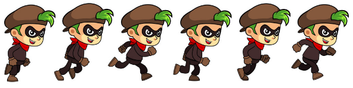

# Øvingsoppgaver

## Lag et klassebilde


Oppgaven er å legge et grid over bildet slik at hver person får en gul firkant i nærheten av ansiktet. Under finner du en css som kommer et stykke på vei.  
Din oppgave er å tilpasse css reglene slik at firkantene kommer nærmere ansiktene. Det er tilstrekkelig at firkanten delvis overlapper ansiktet.  
Merk at bakerste rad har 11 personer - der kan du legge til en egen firkant \(utenom grid-et\).



```css
#astro {
   
    background-image: url(../bilder/astro.jpg);
    background-position: center;
    background-repeat: no-repeat;
    width: 800px;
    height: 477px;
}

#fjes {
    position: relative;
    left: 82px;
    top:51px;
    display: grid;
    grid-template-columns: repeat(10, 1fr);
    height: 200px;
    width: 688px;
}

.fjes {
    position: relative;
    width: 20px;
    height: 20px;
    border: solid yellow 1px;
}

.fjes:nth-child(n + 11) {
   left: 13px;
}

.fjes:nth-child(n + 21) {
    left: -24px;
    top: -28px;
 }

 .fjes:nth-child(n + 24) {
    left: -1px;
    top: -13px;
 }
```



```markup

<body>
    <div id="astro">
        <div id="fjes">
            <div class="fjes"></div>
            ... (3*10)
```



```javascript
function setup() {
  let lyd = document.getElementById("lyd");
  let divAstro = document.getElementById("astro");
  divAstro.addEventListener("click", spill);
 
  function spill() {
    lyd.play();
  }
}
```



Du må lage et nytt prosjekt og legge inn filene over.  
Sørg for at mappe-strukturen stemmer med url i css.

Bruk egenskapen title i div elementene slik at navn på astronautene vise ved peker over \(dette skjer automatisk for element som har title\).

Lag en animasjon for rutene \(.fjes\) slik at firkantene blir til rundinger - varighet 1s  
ved :hover  \(muspeker over firkanten\).

Bruk filen under til å legge til et audio element. Sørg for at det har id="lyd".  
Javascriptet vil spille av lyden ved klikk på bakgrunnen.



## Lag en julekalender

### Kalender i html og css

Bruk bildet under som et utgangspunkt for å lage en julekalender med 24 luker som kan åpnes.


Bruk grid til å plassere 24 diver over bakgrunnsbildet. Hver div skal vise et tall fra 1 til 24.  
Ved klikk på en div skal du vise et nytt bilde i en div \(som ellers er skjult\).

Du trenger da 24 bilder som skal vises \(en for hver luke\). De skal være mindre enn bakgrunnen og skal navngis som bilde1.jpg ... bilde24.jpg

Koden under ordner åpningen av luker ved klikk.  
Forutsetningen for at den skal virke er at du har en div med id="vis", alle lukene har class="luke", alle bildene er navngitt som nevnt og at du har css regler som passer.



```javascript
function setup() {
  let divVis = document.getElementById("vis");
  let lukene = Array.from(document.querySelectorAll(".luke"));
  lukene.forEach( e => e.addEventListener("click", visLuke);
  
  function visLuke(e) {
    let t = e.target;
    let nr = Number(t.innerHTML);
    divVis.style.backgroundImage = `url("bilde${nr}.jpg")`;
    divVis.style.opacity = "1.0";
    setTimeout(() =>  divVis.style.opacity = "0.0", 2000);
  }
}
```



```text

```

## **HTML CSS \(grid og bilder\)**

Du skal lage et nytt prosjekt med følgende mappestruktur:

```text
Avatar
 |------ Bilder
 |         |-- aa00.png
 |         |-- aa01.png 
 :         :    
 :         |-- aa15.png
 |
 |-- avatar.html           
 |-- avatar.css
```

Over er alle navn med stor forbokstav mapper, Bilder inneholder aa00.png ... aa15png \(16 bilder\).

Last ned bildene under inn i mappa Bilder \(høyre-klikk og lagre som - de har navn aa00 ... aa15 \)

|  |  |  |  |
| :--- | :--- | :--- | :--- |
|  |  |  |  |
|  |  |  |  |
|  |  |  |  |

Du skal nå lage en html side **avatar.html** med standard oppsett.

1. Set tittel på dokumentet
2. Link til avatar.css

Legg inn følgende html:

```text
 <div id="main">
        <div id="avatar">
            <div></div>
            ..
            ..
        </div>
</div>
```

Div\#avatar skal inneholde 16 div-er.

Lag **avatar.css** og lag regler slik at:

1. \#avatar bruker grid \(4 kolonner\)
2. alle div-er inne i \#avatar har riktig bakgrunnsbilde \(+ for bruk av nth-of-type \)
3. Fellesregel for alle div inne i \#avatar \(dvs samle det som er felles for alle avatr-bildene inne i _en_ regel\)

## Animasjon med spritesheet



Bruk dette bildet til å lage en animasjon

