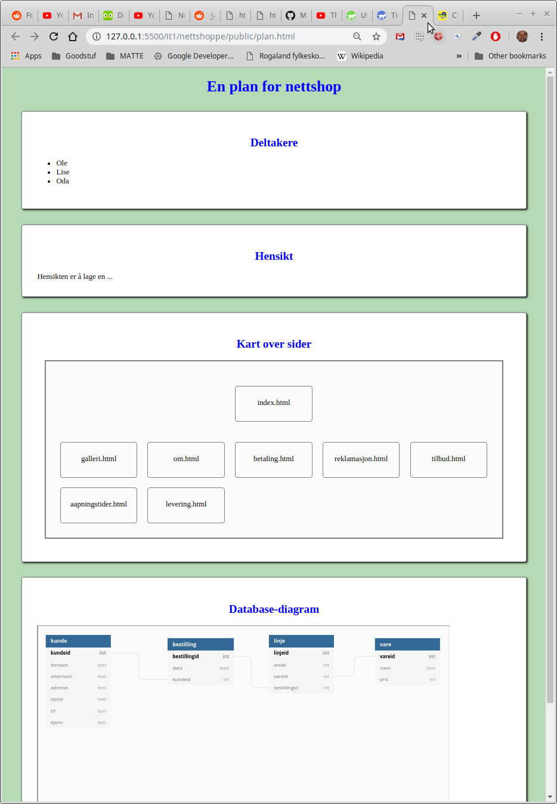

# Krav til prosjektet

### Oversikt

1. Prosjektet skal ha en index.html som ligger i public mappa.
2. På samme plass skal det finnes en plan.html
3. Alle vanlige html-filer skal være linka fra index.html, enten fra meny eller med vanlige linker i en liste på sida.
4. Filer som bruker databasen skal enten ligge i admin mappa \(krever brukernavn og passord\) eller i public.
5. Prosjektet skal bruke spørringer \(sql\)

### index.html

Denne sida kan være ren html/css - men det må være linker til en admin-side \(som den i eksemplet\) eller dere kan lage meny/linker selv.

Under index.html \(linker fra denne\) skal det være sider som:

* viser bilder \(galleri\)
* viser info om firmaet \(om oss\)
* produkter eller andre ting som passer prosjektet \(treningstider, varer osv\)

### plan.html

* deltakere
* hensikt \(beskriv hva sidene skal brukes til, litt om tenkt firma\)
* skisse for kobling mellom sidene
* link til datamodell på dbdiagram.io



### Spørringer

Dere må ha med minst en av hver sort. Under vises noen delvise eksempler.

* Insert   insert into tbl \(x,y,z\) values \(1,2,'nn'\);   &lt; db-insert ... &gt;
* Delete   delete from vare where pris = 0;   Merk at &lt; db-table delete="vare" ... &gt; vil la deg slette varer
* Update   update vare set pris= pris\*1.2;  -- 20% prisøkning   &lt; db-update ... &gt;
* Select   &lt;db-table  sql="select ..."&gt;    select a.x,b.y from a join b on \(a.aid = b.aid\)
* Aggregat spørringer   select count\(\*\) from varer;  -- teller varer   select sum\(pris\*antall\) from linje where bestillingid=xx; -- totalsum for bestilling

Alle spørringer kan legges inn i db-table/db-insert/db-update.   
Det er tilstrekkelig at admin kan kjøre spørringene, men for de som har lyst kan det være interessant å legge inn nye spørringer i app.js.

Komponenten **db-list** gjør mye av det samme som **db-table**, men her kan du legge inn din egen html som vist under

```text
<db-list sql="select fornavn,etternavn,adresse from kunde">
  <div class="brukerliste">
     <span>${fornavn}</span> 
     <span>${etternavn}</span> 
     ${adresse}
  </div>
</db-list>
```

Denne komponenten kan styles fra vanlig css, skriv en regel for _.brukerliste_ .  
Merk at du kan bare ha **en** hovedkomponent \(div,li ... \) inne i **db-list**, men denne kan inneholde mange under-elementer.

```text
db-list {
  border: solid gray 1px;
}

.brukerliste {
  color:blue;
}

.brukerliste span {
  text-transform: capitalize;
}
```


